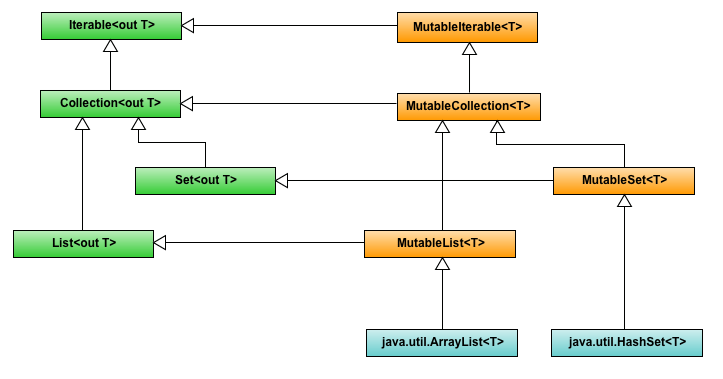

- [1. ¿Qué es Kotlin?](#1-qué-es-kotlin)
- [2. Instalación de Kotlin](#2-instalación-de-kotlin)
- [3. Sintaxis básica](#3-sintaxis-básica)
  - [3.1. Definición e importación de paquetes](#31-definición-e-importación-de-paquetes)
  - [3.2. Punto de entrada de la aplicación](#32-punto-de-entrada-de-la-aplicación)
  - [3.3 Imprimir a la salida estándar](#33-imprimir-a-la-salida-estándar)
  - [3.4 Comentarios](#34-comentarios)
  - [3.5 Variables](#35-variables)
- [4. Tipos básicos](#4-tipos-básicos)
  - [4.1 Números](#41-números)
  - [4.2 Booleanos](#42-booleanos)
  - [4.3 Caracteres](#43-caracteres)
  - [4.4 String](#44-string)
  - [4.5 Conversiones de tipo](#45-conversiones-de-tipo)
- [5. Arrays](#5-arrays)
- [6. Nulabilidad](#6-nulabilidad)
  - [6.1 El operador de llamada segura: ?.](#61-el-operador-de-llamada-segura-)
  - [6.2 El operador Elvis ?:](#62-el-operador-elvis-)
- [7. Condicionales y bucles](#7-condicionales-y-bucles)
  - [7.1 Condicionales](#71-condicionales)
    - [Sentencia if](#sentencia-if)
    - [Sentencia if..else](#sentencia-ifelse)
    - [Sentencia when](#sentencia-when)
  - [7.2 Bucles](#72-bucles)
    - [while](#while)
    - [do..while](#dowhile)
    - [for](#for)
- [8. Rangos](#8-rangos)
  - [8.1 Operador ..](#81-operador-)
  - [8.2 Funciones rangeTo, downTo, step](#82-funciones-rangeto-downto-step)
  - [8.3 Operador in](#83-operador-in)
- [9. Funciones](#9-funciones)
  - [9.1 Parámetros](#91-parámetros)
    - [Parámetros por defecto](#parámetros-por-defecto)
    - [Parámetros con nombres](#parámetros-con-nombres)
    - [Parámetros ilimitados](#parámetros-ilimitados)
  - [9.2 Funciones que no devuelven nada (Unit)](#92-funciones-que-no-devuelven-nada-unit)
  - [9.3 Funciones de expresión única](#93-funciones-de-expresión-única)
  - [9.4 Funciones de alto nivel](#94-funciones-de-alto-nivel)
  - [9.5 Funciones locales](#95-funciones-locales)
  - [9.6 Expresiones lambda](#96-expresiones-lambda)
- [10. Clases y objetos](#10-clases-y-objetos)
  - [10.1 Constructores](#101-constructores)
    - [Constructores secundarios](#constructores-secundarios)
  - [10.2 Creando instancias](#102-creando-instancias)
  - [10.3 Propiedades. Getters y setters](#103-propiedades-getters-y-setters)
  - [10.4 Clases de datos](#104-clases-de-datos)
  - [10.5 Enumeraciones](#105-enumeraciones)
- [11. Colecciones](#11-colecciones)
  - [11.1 Listas](#111-listas)
  - [11.2 Conjuntos](#112-conjuntos)
  - [11.3 Mapas](#113-mapas)
  - [11.4 Otras funciones](#114-otras-funciones)
- [12 Clases abstractas, interfaces y herencia](#12-clases-abstractas-interfaces-y-herencia)
  - [12.1 Clases abstractas](#121-clases-abstractas)
  - [12.2 Interfaces](#122-interfaces)
  - [12.3 Herencia](#123-herencia)

# 1. ¿Qué es Kotlin?


* Kotlin es un lenguaje de programación moderno que **JetBrains** lanzó en 2016
* **Compatible con Java**: el código Java (y sus librerías) se pueden usar en los programas de Kotlin
* Funciona en diferentes plataformas (Windows, Mac, Linux, Raspberry Pi, etc.)
* **Fácil de aprender**, especialmente si se conoce Java
* Gratuito


# 2. Instalación de Kotlin


* Kotlin se instala con **IntelliJ IDEA** y **Android Studio**
* A lo largo del curso trabajaremos con Android Studio
* En este tema podemos probar código en [play.kotlinlang.org](play.kotlinlang.org)


# 3. Sintaxis básica

La documentación oficial de Kotlin está en: [https://kotlinlang.org/](https://kotlinlang.org/)


## 3.1. Definición e importación de paquetes

* La especificación del paquete debe estar en la parte superior del archivo fuente

```kotlin
package my.demo

import kotlin.text.*

// ...
```


## 3.2. Punto de entrada de la aplicación

* El punto de entrada es la función **main**:

```kotlin
fun main() {
  println("Hello World")
}
```

* También se puede pasar un número variable de parámetros

```kotlin
fun main(args: Array<String>) {
    println("El primer parámetro es" + ${args[0]})
}
```


## 3.3 Imprimir a la salida estándar

* **print** imprime su argumento en la salida estándar

```kotlin
print("Hello ")
print("world!")
```

* **println** imprime sus argumentos y agrega un salto de línea

```kotlin
println("Hello world!")
println(42)
```


## 3.4 Comentarios

* Al igual que la mayoría de los lenguajes modernos, Kotlin admite comentarios de una sola línea (o de final de línea ) y de varias líneas (bloque)

```kotlin
// This is an end-of-line comment

/* This is a block comment
   on multiple lines. */
```


## 3.5 Variables

* Las variables locales de **solo lectura** se definen mediante la palabra clave ***val***
* Se les puede asignar un valor solo una vez

```kotlin
val a: Int = 1  // asignación inmediata
val b = 2   // tipo `Int` inferido
val c: Int  // tipo requerido cuando no se inicializa
c = 3       // asignación diferida
```

* Las variables que se pueden reasignar utilizan la palabra clave ***var***

```kotlin
var x = 5 
x += 1
```

# 4. Tipos básicos


* En Kotlin **todo es un objeto**. Se podrán llamar a funciones y propiedades de cualquier variable
* Los tipos de datos se dividen en diferentes grupos:
  * Números
  * Caracteres
  * Booleanos
  * String
  * Arrays


## 4.1 Números

* Los tipos de números se dividen en dos grupos:
  * Los tipos **enteros** almacenan números enteros, positivos o negativos (como 123 o -456), sin decimales. 
  * Los tipos válidos son **Byte** (8 bits), **Short** (16 bits), **Int** (32 bits) y **Long** (64 bits)

```kotlin
val myByte: Byte = 100
val myShort: Short = 5000
val myInt: Int = 100000
val myLong: Long = 15000000000L
```


  * Los tipos de **coma flotante** representan números con una parte fraccionaria, que contienen uno o más decimales. 
  * Hay dos tipos: **Float** (32 bits) y **Double** (64 bits).

```kotlin
val myFloat: Float = 5.75F
val myDouble: Double = 19.99
```


## 4.2 Booleanos

* El tipo Boolean solo puede tomar los valores true o false:

```kotlin
val myTrue: Boolean = true
val myFalse: Boolean = false
```


## 4.3 Caracteres

* El tipo **Char** se utiliza para almacenar un solo carácter. El valor debe estar entre comillas simples , como 'A' o 'c':

```kotlin
val myChar: Char = 'B'
```


## 4.4 String

* El tipo String se utiliza para almacenar una secuencia de caracteres (texto). Los valores de cadena deben estar entre comillas dobles \":

```kotlin
val myString: String = "Hola"
```


* Los elementos de una cadena son caracteres a los que puede acceder a través de la operación de indexación: s[i]. Se puede iterar sobre estos caracteres con un bucle for:

```kotlin
val myString: String = "Hola"
for (c in myString) {
    println(c)
}
```


* Las cadenas son **inmutables**. 
* Una vez que inicializa una cadena, no puede cambiar su valor ni asignarle un nuevo valor. Todas las operaciones que transforman cadenas devuelven sus resultados en un nuevo objeto String, dejando la cadena original sin cambios:

```kotlin
val str = "abcd"
println(str.uppercase()) // Crea y pinta un nuevo objeto String
println(str)             // La cadena original sigue siendo la misma
```


* Para concatenar cadenas, se puede utilizar el **operador +**. 
* Esto también funciona para concatenar cadenas con valores de otros tipos, siempre que el primer elemento de la expresión sea una cadena:

```kotlin
val s = "abc" + 1
println(s + "def")
```


**String templates**

* Son fragmentos de código que se evalúan y cuyos resultados se concatenan en la cadena. 
* Una expresión de plantilla comienza con un signo de dólar ($) y consta de un nombre:

```kotlin
val i = 10
println("i = $i") // Imprime "i = 10"
```

* O una expresión entre llaves:

```kotlin 
val s = "abc"
println("La longitud de $s es ${s.length}") // Imprime "La longitud de abc es 3"
```


## 4.5 Conversiones de tipo

* En Kotlin, la conversión de tipos numéricos es diferente de Java. 
* Por ejemplo, no es posible convertir un tipo Int a un Long con el siguiente código:

```kotlin
val x: Int = 5
val y: Long = x // Error: Type mismatch 
```


* Para convertir un tipo de dato numérico a otro tipo, hay que usar una de las siguientes funciones: **toByte()**, **toShort()**, **toInt()**, **toLong()**, **toFloat()**, **toDouble()** o **toChar()**

```kotlin
val x: Int = 5
val y: Long = x.toLong()
```


# 5. Arrays


* Los arrays en Kotlin están representados por la clase **Array**
  * Tiene los métodos **get()** y **set()**
  * Posee el operador **[]**
  * Tiene la propiedad **size** 

* Para crear una matriz, se usa la función **arrayOf()** pasándole los valores de los elementos

```kotlin
val miArray = arrayOf(1,2,3)
for (dato in miArray) {
    println(dato)
}
```


* El operador [] equivale a las llamadas get() y set()

```kotlin
val miArray = arrayOf(1,2,3)
println(miArray[0])     //Imprime 1
println(miArray.get(2)) //Imprime 3
miArray.set(2,5)        //Establece un 5 en la posición 2
println(miArray[2])     //Imprime 5
```


* También puedo crear un array mixto:

```kotlin
val miArray = arrayOf(1,"Hola",false)
for (dato in miArray){
    println(dato)
}
```


* Para hacer cumplir que todos los valores del array tienen el mismo tipo (por ejemplo Int) declaramos un tipo llamando **arrayOf<Int>()** o **intArrayOf()**:

```kotlin
val myArray3 = arrayOf<Int>(1,2,3) 
val myArray4 = intArrayOf(4, 5, 6, 7 ,8) 
```

* También tenemos otras funciones de utilidad para crear arrays de otros tipos como **charArrayOf()**, **booleanArrayOf()**, **longArrayOf()**, **shortArrayOf()**, **byteArrayOf()**, etc. 


* Otra opción para crear un array es utilizar el **constructor de Array**.
* El constructor de esta clase requiere un **tamaño** y una **función lambda**

```kotlin
val miArray = Array(5, { i -> i * 2 }) //Se crea con los valores 0,2,4,6,8
for(dato in miArray){
    println(dato)
}
```


> Hoja00_Kotlin_01


# 6. Nulabilidad


* El sistema de tipos de Kotlin tiene como objetivo eliminar el peligro de las referencias nulas
  * Por ejemplo cuando intentas llamar a un método o leer una propiedad de una referencia de objeto que es null
  * En Java esto sería el equivalente de un *NullPointerException*
* En Kotlin las variables **no pueden tener el valor null a menos que declare explícitamente** que su tipo puede ser null. 
* **Por defecto, los tipos no pueden ser null**:

```kotlin
var nombre: String = null // no compilará
```


* Para que el compilador permita la asignación, hay que declarar la variable nombre como un nullable agregando ? después del tipo:

```kotlin
var nombre: String? = null 
nombre = "Iván"
```

* Funcionará igual con Int?, Byte?, Long?, MiClase?, etc...


## 6.1 El operador de llamada segura: ?.

* El siguiente código no compilará ya que Kotlin es un lenguaje seguro contra valores null

```kotlin
var nombre: String? = "Iván"
print(nombre.length) // no compilará
```

* Invocar la propiedad length en esa variable desencadenaría un error NullPointerException en Java. 
* El compilador no permitirá la invocación de esta propiedad porque la variable podría ser null


* Debemos agregar el operador de llamada segura **?.** a la variable antes de invocar la propiedad.
* Le indicamos al compilador que invoque la propiedad solo si el valor no es null. 
* Si el valor es null, el compilador usará la cadena "null"

```kotlin
var nombre: String? = "Iván"
println(nombre?.length)  //Imprimirá 4
nombre = null
println(nombre?.length)  //Imprimirá "null"
```


* Para omitir la comprobación de nulabilidad se puede reemplazar el operador ?. con !!
* No se recomienda, debido a la alta probabilidad de obtener NullPointerException


```kotlin
val nombre: String? = null
val longitud: Int? = nombre!!.length
println(longitud) 
```


## 6.2 El operador Elvis ?:

* Se utiliza para proporcionar un valor alternativo a la variable si es null.

```kotlin
val nombreUsuario: String? = null
val nombre = nombreUsuario ?: "Sin nombre"
println(nombre) // compila e imprime "Sin nombre"
```

* Aquí, el compilador asignó la cadena "Sin nombre" a la variable nombre, porque el valor de nombreUsuario es null. 


# 7. Condicionales y bucles


## 7.1 Condicionales

* Kotlin tiene tres tipos de sentencias de condicionales: if, if..else y when

### Sentencia if

* Una sentencia if ejecuta algún código si una condición es verdadera, o simplemente la omite, si la condición es falsa

```kotlin
val numero = 84
if (numero % 2 == 0) {
  print("$numero es divisible entre 2") 
}
```


* También podemos verificar si una variable es de un tipo particular usando la palabra clave **is**.

```kotlin
if (numero is Int) {
  print("$numero es un entero")
}
```


### Sentencia if..else

* if..else realiza una acción si la condición es verdadera y realiza una acción diferente si la condición es falsa

```kotlin
val numero = 15
if (numero % 2 == 0) {
  print("$numero es divisible entre 2")
} else{
  print("$numero NO es divisible entre 2")
}
```


* Una diferencia con otros lenguajes es que la sentencia if..else en Kotlin **permite asignar a una variable el valor devuelto por la instrucción if..else**. 
* Esto es posible porque una sentencia if..else puede usarse no solo como una sentencia, sino también como una expresión en Kotlin.

```kotlin
    val numero = 15
    val resultado = if (numero % 2 == 0) {
        "$numero es divisible entre 2"
    } else{
        "$numero NO es divisible entre 2"
    }
    print(resultado)
```


### Sentencia when

* Kotlin introdujo la construcción **when** como un reemplazo de la conocida sentencia switch


```kotlin
    val numero = 3
    when (numero) {
        1 -> println("numero es 1")
        2 -> println("numero es 2")
        3 -> println("numero es 3")
        else -> println("numero no es ni 1, ni 2, ni 3")
    }
```

* La expresión when verifica si alguna de las ramas coincide con el valor de numero y luego ejecuta la acción en esa rama. Si ninguna de las ramas coincide, se ejecuta la rama else.


* Otra variante de la expresión when no requiere ningún argumento:

```kotlin
    val numero = 3
    when
    {
        numero == 1 -> println("numero es 1")
        numero == 2 ->
        {
            println("numero es 2")
            println("2 es par")
        }
        numero == 3 -> println("numero es 3")
        else -> println("numero no es ni 1, ni 2, ni 3")
    }
```

* Si queremos ejecutar más de una acción en una rama, necesitamos envolver las acciones entre **llaves {}**


* Además, podemos combinar valores de prueba en una sola rama.

```kotlin
    val numero = 2
    when (numero) {
        1,2 -> println("numero es 1 o 2")
        3 -> println("numero es 3")
    }
```


## 7.2 Bucles

* Kotlin tiene bucles while, do-while y for

### while

* Una sentencia de repetición nos permite especificar que el código debe repetir una acción mientras alguna condición sea verdadera
* Similar a otros lenguajes como Java

```kotlin
    var numero = 2
    while(numero <= 10)
    {
        println(numero)
        numero++
    }
```


### do..while

* Similar a la sentencia while. 
* En el bucle while, el programa prueba la condición del bucle al principio. Si la condición es falsa, el cuerpo no se ejecuta
* Pero el bucle do-while prueba la condición después de ejecutar el cuerpo del bucle. Esto significa que **el cuerpo se ejecuta al menos una vez**

```kotlin
    var numero = 2
    do {
        println(numero)
        numero++
    }while(numero <= 10)
```


### for

* Un bucle for es una sentencia de repetición que nos permite iterar sobre objetos mientras una condición dada es verdadera

```kotlin
for (valor in rango) {
    // Código
}
```

* En Kotlin, el bucle for funciona con iteración sobre **rangos**, **colecciones** u otros **iterables**
* Los bucles for funcionan junto con el **operador in**, que se utiliza para determinar si un valor está presente en un rango determinado


```kotlin
    for (a in 1..5) {
        print("$a ") // imprime  1 2 3 4 5
    }
```

* Aquí iteramos a través de un rango cerrado de 1 a 5 e imprimimos cada valor en el rango


* Podemos usar la función **withIndex()** o la propiedad de **indices** en un array para iterar sobre un array donde necesitamos el índice para cada elemento


**withIndex()**

* Podemos iterar sobre un array llamando a la función withIndex() del array
* Devuelve un iterable de tipo IndexedValue para cada elemento. Nos permite acceder tanto al índice como al valor de cada elemento

```kotlin
    val stringArray = arrayOf<String>("Bienvenidos", "a", "Kotlin", "en", "PMDM")
    for ((indice, valor) in stringArray.withIndex()) {
        print("El valor del índice $indice es $valor\n")
    }
    /*
    El valor del índice 0 es Bienvenidos
    El valor del índice 1 es a
    El valor del índice 2 es Kotlin
    El valor del índice 3 es en
    El valor del índice 4 es PMDM
     */
```


**indices**

* La propiedad indices devolverá solo el rango de índices válidos para el array

```kotlin
    val stringArray = arrayOf<String>("Bienvenidos", "a", "Kotlin", "en", "PMDM")
    for (indice in stringArray.indices) {
        print("El valor del índice $indice es ${stringArray[indice]}\n")
    }
```

* El código anterior producirá el mismo resultado que el ejemplo anterior


# 8. Rangos


* Un Rango en Kotlin es un tipo único que define un valor de inicio y un valor final
* Los Rangos son cerrados: el valor inicial y el valor final están incluidos en el rango


## 8.1 Operador ..

```kotlin
    val unoADiez = 1..10 //Valores desde 1 hasta 10 (incluidos)
```

* Podemos iterar con un bucle for

```kotlin
    val unoADiez = 1..10
    for (numero in unoADiez)
        print("$numero ")
```

* Podemos no crear la variable unoADiez

```kotlin
    for (numero in 1..10)
        print("$numero ")
```


* También podemos crear un rango de caracteres:

```kotlin
    val desdeAHastaZ = 'a'..'z'
```

* La variable desdeAHastaZ tendrá todas las letras en el alfabeto inglés.


## 8.2 Funciones rangeTo, downTo, step

* El operador .. puede ser reemplazado con la función de extensión **rangeTo()**
* Podemos modificar el rango usando la función **step()**. Esto añadirá un "salto" entre cada elemento
* La función **downTo()** creará un rango comenzando desde un número dado hacia otro

```kotlin
    val unoADiez = 1.rangeTo(10)
    val unoADiezImpares = 1.rangeTo(10).step(2)
    val diezAUno = 10.downTo(1)

    val rango = 1..10 step 3
```


## 8.3 Operador in

* El operador in es usado para saber si un valor está presente en un rango dado.

```kotlin
if (5 in 1..10) {
    print("5 está en el rango") // imprime "5 está en el rango"
}
```

* Comprobamos si el 5 está en el rango 1..10 usando el operador in. 
* También podemos hacer lo contrario usando !in para revisar si 5 no está en el rango.


> Hoja00_Kotlin_02


# 9. Funciones


* Definidas usando la palabra reservada **fun**

```kotlin
    fun hola(nombre: String): String
    {
        return "Hola $nombre"
    }
    val mensaje = hola("Iván")
    print(mensaje) // "Hola Iván"
```

* Función **hola** con un parámetro llamado **nombre** de tipo **String**. Devuelve un **String**


## 9.1 Parámetros

* El formato de definición de parámetros es: **nombre: tipo**
* Si tenemos varios los separamos por una coma (,)


### Parámetros por defecto

* Los parámetros pueden tener un valor predeterminado. Esto reduce el número de sobrecargas de métodos

```kotlin
    fun suma(x:Int, y:Int, z:Int = 0): Int
    {
        return x + y + z
    }
    println(suma(4,3)) //7
    println(suma(4,2,3)) //9
```


* Ejemplo:

```kotlin
    fun imprimeNombre(nombre: String, apellido1: String = "Lorenzo", apellido2: String)
    {
        println("$nombre $apellido1 $apellido2")
    }

    imprimeNombre("Iván", "Lorenzo", "Rubio")
    imprimeNombre("Iván", "Rubio") //Error
```

* No compilará porque no sabe si tiene que pasar "Rubio" como apellido1 o como apellido2
* Para resolver esto, se usan los parámetros con nombre


### Parámetros con nombres

* El siguiente código funciona perfectamente:

```kotlin
    imprimeNombre("Iván", apellido2 = "Rubio") //Ahora funciona correctamente
    imprimeNombre(apellido2 = "Rubio", nombre = "Iván")
    imprimeNombre(apellido1 = "Lorenzo", nombre = "Iván", apellido2 = "Rubio")
```


### Parámetros ilimitados

* En Java podemos crear un método para recibir un número no especificado de parámetros incluyendo puntos suspensivos (...) después de un tipo en la lista de parámetro del método. 
* Este concepto existe en Kotlin. Se usa el modificador **vararg** seguido por el nombre del parámetro.

```kotlin
    fun imprimeCadenas(vararg cadenas: String)
    {
        for(cadena in cadenas)
            println(cadena)
    }
    imprimeCadenas("PMDM","AD")
    imprimeCadenas("PMDM","AD","DI","PSP")
```


**Operador de propagación**

* Cuando tenemos varags podemos pasar los parámetros uno a uno como en el ejemplo anterior.
* Pero si ya tenemos un array podemos pasárselo usando el **operador de propagación** (*)

```kotlin
    val lista = arrayOf<String>("PMDM","AD","DI")
    imprimeCadenas(lista, "PSP") //Error
    imprimeCadenas(*lista, "PSP") //Funciona
```


## 9.2 Funciones que no devuelven nada (Unit)

* Si una función no devuelve nada (void en Java), en Kotlin devolverá un **Unit**
* Podemos no poner el tipo Unit

```kotlin
    fun hola(nombre: String): Unit
    {
        print("Hola $nombre")
    }

    //Similar a...
    fun hola(nombre: String)
    {
        print("Hola $nombre")
    }
```


## 9.3 Funciones de expresión única

* Cuando una función **devuelve una sola expresión**, las llaves se pueden omitir y el cuerpo se especifica después del símbolo =:

```kotlin
fun doble(x: Int): Int = x * 2
```


* Podemos no poner el tipo de retorno si el compilador puede inferirlo:

```kotlin
fun doble(x: Int) = x * 2
```


## 9.4 Funciones de alto nivel

* Las funciones de alto nivel son funciones dentro de un paquete que son definidas fuera de cualquier clase, objeto o interface.
* En Java esto habría que hacerlo con métodos estáticos dentro de clases auxiliares.

```kotlin
//Fichero Utilidades.kt
package es.ivanlorenzo.utilidades

fun multiplicar(valor1: Int, valor2: Int): Int{
    return valor1*valor2
}
```


* Desde otro fichero o clase podemos llamar a esta función

```kotlin
import es.ivanlorenzo.utilidades.multiplicar

fun main() {
    println(multiplicar(3,4))
}
```


## 9.5 Funciones locales

* Kotlin proporciona **funciones locales** o funciones **anidadas**. 
* Una función local se declara dentro de otra función.

```kotlin
fun imprimeCircunferenciaYRadio(radio: Double)
{
    fun calculaCircunferencia(): Double = (2 * Math.PI) * radio
    val circunferencia = "%.2f".format(calculaCircunferencia())

    fun calculaArea(): Double = (Math.PI) * Math.pow(radio, 2.0)
    val area = "%.2f".format(calculaArea())

    print("La circunferencia de radio $radio es $circunferencia y su área es $area")
}
```


## 9.6 Expresiones lambda

* Pueden pasarse como parámetros a otras funciones llamadas **funciones de orden superior**: función que reciben otra función (o expresión lambda) como parámetro, devuelve una función, o ambas cosas.


* Características:
  * Debe escribirse entre llaves {}.
  * **No** tiene la palabra reservada fun.
  * **No** hay modificador de acceso (privado, público o protegido) porque no pertenece a ninguna clase, objeto o interfaz.
  * **No** tiene un nombre de función. Es anónima.
  * **No** hay que especificar el tipo de retorno.
  * Los parámetros **no** se escriben entre paréntesis ().


 Sus componentes son:

* Lista de **parámetros**: cada parámetro es una declaración de variable, aunque esta lista es opcional
* **Operador de flecha** (->): se omite si no usas lista de parámetros
* **Cuerpo del lambda**: son las sentencias que van luego del operador de flecha


```kotlin
    val mensaje = { println("Kotlin mola!") }
    mensaje()

    val mensajeParametro = { texto:String -> println(texto) }
    mensajeParametro("Kotlin es más claro que Java")

    val restaVariosParametros = { numero1: Int, numero2: Int ->
                    println("Puedo escribir varias sentencias")
                    numero1 - numero2
        }
    println(restaVariosParametros(5,3))
```


**Lambdas a funciones**

* Contar los caracteres 'n' de un texto:

```kotlin
    val nombre = "Iván Lorenzo"
    println(nombre.count()) //12
    println(nombre.count(){letra -> letra == 'n'}) 
    println(nombre.count{letra -> letra == 'n'})
    println(nombre.count{ it == 'n'})
```


* Más ejemplos

```kotlin
    val modulos: List<String> = listOf("PMDM", "AD", "DI", "PSP", "SGE", "EIE")
    println(modulos.last()) // EIE
    println(modulos.last(){ modulo -> modulo.length == 2 }) //DI
    //Omitir paréntesis
    println(modulos.last{ modulo -> modulo.length == 4}) //PMDM
    //Si la lambda usa un único parámetro se puede poner it
    println(modulos.last{ it.startsWith("S")}) //SGE
    modulos.forEach {println(it)} //Imprime todos
    //Buscamos los de tamaño 3 y que no contengan la P y luego recorremos e imprimimos
    modulos.filter { it.length == 3 && !it.contains("P")}?.forEach { println(it) }
```


> Hoja00_Kotlin_03


# 10. Clases y objetos


* En Kotlin declaramos una clase utilizando la palabra reservada **class** (como en Java)

```kotlin
class Alumno
```

* ¡Y ya está!


## 10.1 Constructores

* Una clase en Kotlin puede tener un constructor primario y uno o más constructores secundarios.
* El constructor principal se declara en el encabezado

```kotlin
class Alumno constructor(val nombre: String, val apellidos: String, var edad: Int)
```

* Si el constructor no tiene modificadores de visibilidad ni anotaciones la palabra constructor se puede quitar

```kotlin
class Alumno(val nombre: String, val apellidos: String, var edad: Int)
```


* El constructor principal no puede contener código. 
* El código de inicialización se puede colocar en bloques de inicialización con la palabra reservada **init**

```kotlin
class Alumno (val nombre: String, val apellidos: String, var edad: Int)
{
    val nota = (0..10).random()
    init {
        if(edad>18)
            println("La nota aleatoria es $nota")
    }
}
```


* Cada parámetro se puede definir como val (propiedad de sólo lectura) o var (lectura-escritura)
* **Si no ponemos ni val ni var los parámetros no son propiedades de la clase**. Simplemente serán parámetros a los que podemos acceder a través del bloque init o usarlos para inicializar otras propiedades


```kotlin
class Alumno (nombre: String, apellidos: String, var edad: Int)
{
    val nombreCompleto = "$nombre $apellidos"
    val nota = (0..10).random()
    init {
        println("El nombre en mayúsculas es ${nombre.uppercase()}")
    }
}

val alumno = Alumno("Juan", "Pérez", 25)
println(alumno.nombreCompleto)
alumno.edad = 35
println(alumno.nombre) //Error. No es una propiedad
```

* Al crear un objeto de tipo Alumno podemos acceder a las propiedades edad, nombreCompleto y nota
* Además, edad podríamos modificarla


### Constructores secundarios

* Tienen el prefijo **constructor**

```kotlin
class Persona
{
    var nombre: String = "Ninguno"
    constructor(nombre: String)
    {
        this.nombre = nombre
    }
}

fun main() {
    val persona = Persona("Iván")
    println(persona.nombre)
}
```


* **No podemos declarar propiedades dentro de un constructor secundario** (con val o var). Simplemente podemos pasar parámetros
* Si queremos hacerlo, tenemos que declararlas dentro del cuerpo de la clase y luego inicializarlas en el constructor secundario


* Podemos combinar constructores primarios con secundarios, pero tenemos que **invocar al constructor primario** desde el secundario **con la palabra this**

```kotlin
class Persona(val nombre: String)
{
    val hijos = mutableListOf<Persona>()
    constructor(nombre: String, padre: Persona) : this(nombre) {
        padre.hijos.add(this)
    }
}

fun main() {
    val padre = Persona("Pepe")
    val hijo = Persona("Pepito", padre)
    val hija = Persona("Pepita", padre)
    println("Los hijos de ${padre.nombre} son ${padre.hijos.joinToString(", ") { p -> p.nombre }}")
}
```


## 10.2 Creando instancias

* Ya hemos visto que podemos instanciar una clase utilizando algún constructor
* **No** se usa la palabra reservada new

```kotlin
class Alumno(var nombre: String)
fun main()
{
    val alumno = Alumno("Juan")
    alumno.nombre = "Juanillo"
    println(alumno.nombre)  
}

```


**Casteo inteligente**

* En Java utilizamos el operador **instanceof** para comprobar si un objeto es de una determinada clase. Por ejemplo:

```java
/* Java */
if (figura instanceof Circulo) {
    Circulo circulo = (Circulo) figura;
    circulo.calculaCircunferencia(3.5); 
}
```


* En Kotlin utilizamos la palabra reservada **is**. 
* Además, el compilador detecta que el if sólo se ejecuta si es un círculo y, por tanto, hace el casting por nosotros

```kotlin
/* Kotlin */
if (figura is Circulo) {
    figura.calculaCircunferencia(3.5)
}
```


## 10.3 Propiedades. Getters y setters

* Cada vez que accedemos a una propiedad y modificamos su valor se ejecuta su método set.
* Lo mismo sucede cada vez que obtenemos el valor de una propiedad con el método get.
* Pero no tenemos que crearlos. Kotlin ya nos los ofrece.


* Podríamos crear un **getter o setter personalizado**

```kotlin
class Alumno(nombre: String)
{
    var nombre: String = nombre
    get() = field.uppercase()
    set(value) {
        field = "Alumno: $value"
    }
}
fun main()
{
    val alumno = Alumno("Juan")
    alumno.nombre = "Juanillo"
    println(alumno.nombre) //ALUMNO: JUANILLO
}
```


## 10.4 Clases de datos

* ¿Os acordáis de las clases POJO (Plain Old Java Object) de Java?
* Su objetivo fundamental es almacenar datos

```java
import java.time.LocalDate;
import java.util.Objects;

public class Coche
{
    private String marca;
    private String modelo;
    private String matricula;
    private LocalDate fechaMatriculacion;

    //Constructores

    //Getters y setters


    @Override
    public boolean equals(Object o) {
        if (this == o) return true;
        if (o == null || getClass() != o.getClass()) return false;
        Coche coche = (Coche) o;
        return matricula.equals(coche.matricula);
    }
    
    @Override
    public int hashCode() {
        return Objects.hash(matricula);
    }

    @Override
    public String toString() {
        return "Coche{" +
                "marca='" + marca + '\'' +
                ", modelo='" + modelo + '\'' +
                ", matricula='" + matricula + '\'' +
                ", fechaMatriculacion=" + fechaMatriculacion +
                '}';
    }
}
```


* Kotlin proporciona el modificador **data** para eliminar mucho código

```kotlin
import java.time.LocalDate

data class Coche(val marca: String, val modelo: String,
                 val matricula: String, var fechaMatriculacion: LocalDate)
```

* Y ya tendremos los métodos equals, hashCode, toString y getters y setters

```kotlin
fun main()
{
    val coche = Coche("Audi", "A4", "1234LLL", LocalDate.of(2022,9,20))
    val coche2 = Coche("Audi", "A4", "1234LLL", LocalDate.of(2022,9,20))
    println(coche.equals(coche2)) //true
    println(coche == coche2) //true. Equivalente a equals
    println(coche.toString())
}
```


## 10.5 Enumeraciones

* Kotlin ofrece también enumeraciones. Se usa la palabra reservada **enum** antes de class

```kotlin
enum class Comunidad {
    CANTABRIA,
    ASTURIAS,
    PAÍS_VASCO,
    CASTILLA_Y_LEON,
    GALICIA
}
```


* Algunos métodos que podemos usar son los siguientes:

```kotlin
    println(Comunidad.valueOf("ASTURIAS")) //Recuperamos un valor
    println(enumValueOf<Comunidad>("CANTABRIA"))
    Comunidad.values() //Devuelve un array con todos los valores
    Comunidad.values().forEach { println(it) }
```


**Constructores Enum**

* Podemos crear constructores en las enumeraciones

```kotlin
enum class Comunidad (val codigo: Int){
    CANTABRIA (6),
    ASTURIAS (3),
    PAÍS_VASCO (16),
    CASTILLA_Y_LEON (7),
    GALICIA (12)
}
```

* Accedemos a la propiedad:

```kotlin
fun main()
{
    val comunidad = Comunidad.ASTURIAS
    print(comunidad.codigo) // 3
}
```


> Hoja00_Kotlin_04


# 11. Colecciones


* Kotlin proporciona su API de colecciones como una librería estándar construida encima de la API de Colecciones Java

* Kotlin tiene dos variantes de colecciones: 
  * **Mutables**: nos proporciona la habilidad de modificar una colección ya sea agregando, borrando o reemplazando un elemento
  * **Inmutables**: no pueden ser modificadas y no tienen estos métodos




* Interface **Iterable**: permite que las colecciones puedan ser iteradas

```kotlin
public interface Iterable<out T> {
    public abstract operator fun iterator(): Iterator<T>
}
```


* Interface **Collection**: hereda de Iterable. Es inmutable. Las interfaces Set y List en Kotlin heredan de esta interface

```kotlin
public interface Collection<out E> : Iterable<E> {
    public val size: Int
    public fun isEmpty(): Boolean
    public operator fun contains(element: @UnsafeVariance E): Boolean
    override fun iterator(): Iterator<E>
    public fun containsAll(elements: Collection<@UnsafeVariance E>): Boolean
}
```


* Interface **MutableIterable**: iterador ***mutable*** especializado de la interfaz padre Iterable

```kotlin
public interface MutableIterable<out T> : Iterable<T> {
    override fun iterator(): MutableIterator<T>
}
```


* Interface **MutableCollection**: posibilita a las colecciones para ser mutables. 
  * Hereda de la interface Collection y la interface MutableIterable
  * Las interfaces MutableSet y MutableList heredan de esta interfaz

```kotlin
public interface MutableCollection<E> : Collection<E>, MutableIterable<E> {
    override fun iterator(): MutableIterator<E>
    public fun add(element: E): Boolean
    public fun remove(element: E): Boolean
    public fun addAll(elements: Collection<E>): Boolean
    public fun removeAll(elements: Collection<E>): Boolean
    public fun retainAll(elements: Collection<E>): Boolean
    public fun clear(): Unit
}
```


## 11.1 Listas

* Podemos crear listas:
  * Usando la Función **listOf()**: lista inmutable
  * Usando la Función **listOfNotNull()**: lista inmutable
  * Usando la Función **arrayListOf()**: lista mutable. Devuelve un ArrayList de Java
  * Usando la Función **mutableListOf()**: lista mutable. Devuelve un MutableList


**listOf()**: devuelve una List

```kotlin
    val listaString = listOf<String>("hola", "a", "todos")
    val listaEnteros : List<Int> = listOf(1,2,3,4)
    val listaMixta = listOf("Pepe", 1, false)
    for (elemento in listaString)
        println(elemento)
```

**listOfNotNull()**: devuelve una List **conteniendo sólo los valores no nulos**


```kotlin
    val listaNoNulos = listOfNotNull("hola", false, 100, null, 33, null)
    println(listaNoNulos.size) //4
    println(listaNoNulos.get(0))  //hola
    println(listaNoNulos.contains(100)) //true
    println(listaNoNulos.indexOf(false)) //1
```


**arrayListOf()**: devuelve un ArrayList de Java

```kotlin
    val listaString = arrayListOf<String>("AD", "PMDM", "PSP")
    listaString.forEach{println(it)}
    listaString.add("DI")
    listaString.add(0, "EIE")
    for((indice, modulo) in listaString.withIndex()) {
        println("$indice: $modulo")
    }
```


**arrayListOf()**: devuelve un MutableList de Kotlin

```kotlin
    val listaMutable: MutableList<String> = mutableListOf("Pepe", "María", "Juan")
    listaMutable.add("Lucía")
    listaMutable.removeAt(2)
    listaMutable[0] = "Pepín"
    listaMutable.remove("María")
    listaMutable.forEach{println(it)}
```


## 11.2 Conjuntos

* Un conjunto es una colección sin orden de elementos únicos, es decir, sin duplicados
* Podemos crear conjuntos con las funciones:
  * **setOf()**: conjunto inmutable. Devuelve un Set
  * **hashSetOf()**: mutable. HashSet de Java
  * **linkedSetOf()**: mutable. LinkedHashSet de Java
  * **sortedSetOf()**: mutable. TreeSet de Java
  * **mutableSetOf()**: mutable. MutableSet de Kotlin, equivalente a LinkedHashSet de Java
  


**setOf()**: devuelve un Set

```kotlin
    val setMixto = setOf(5, 3.14, true, "hola", 'c')

    var setEnteros: Set<Int> = setOf(1, 3, 4, 3, 2, 2)
    setEnteros.forEach{println(it)} //Imprimirá 1, 3, 4, 2
```


**hashSetOf()**: devuelve un HashSet de Java. Es una colección mutable

```kotlin
    val setEnteros: HashSet<Int> = hashSetOf(1, 3, 4, 3, 2)
    setEnteros.add(5)
    setEnteros.remove(2)
    setEnteros.forEach{println(it)} //Imprimirá 1, 3, 4, 5
```


**linkedSetOf()**: devuelve una LinkedHashSet de Java. Es mutable. Mantiene el orden en el que fueron insertados los elementos

```kotlin
    val setEnteros: LinkedHashSet<Int> = linkedSetOf(1, 3, 4, 3, 2)
    setEnteros.add(5)
    setEnteros.forEach{println(it)} //Imprimirá 1, 3, 4, 2, 5
```


**sortedSetOf()**: devuelve un TreeSet de Java. Es una colección mutable. Los ordena basándose en su ordenamiento natural o un comparador

```kotlin
    val setEnteros: TreeSet<Int> = sortedSetOf(1, 3, 4, 3, 2)
    setEnteros.add(5)
    setEnteros.forEach{println(it)} //Imprimirá 1,2,3,4,5
```


**mutableSetOf()**: devuelve un MutableSet de Kotlin, equivalente a LinkedHashSet de Java

```kotlin
    val setEnteros: MutableSet<Int> = mutableSetOf(1, 3, 4, 3, 2)
    setEnteros.add(5)
    setEnteros.forEach{println(it)} //Imprimirá 1, 3, 4, 2, 5
```


## 11.3 Mapas

* Asocian claves con valores. Las claves deben ser únicas
* Podemos crear un map con las funciones:
  * **mapOf()**: colección inmutable. Devuelve un Map
  * **mutableMapOf()**: mutable. Devuelve un MutableMap de Kotlin
  * **hashMapOf()**: devuelve un HashMap de Java
  * **linkedHashMap()**: devuelve un LinkedHashMap de Java
  * **sortedMapOf()**: devuelve un SortedMap de Java


**mapOf()**

```kotlin
    val mapaInmutable: Map<Int, String> = mapOf(33 to "Asturias", 39 to "Cantabria", 
        34 to "Palencia", 24 to "León", 27 to "Lugo")
    for ((clave, valor) in mapaInmutable) {
        println("El código de $valor es $clave")
    }
    println(mapaInmutable[39]) // Cantabria
    println(mapaInmutable.size) //5
    println(mapaInmutable.containsKey(10)) //false
    println(mapaInmutable.keys) //[33, 39, 34, 24, 27]
    println(mapaInmutable.values) //[Asturias, Cantabria, Palencia, León, Lugo]
```


**mutableMapOf()**

```kotlin
    val mapaMutable: MutableMap<Int, String> = mutableMapOf(33 to "Asturias", 39 to "Cantabria", 34 to "Palencia", 24 to "León", 27 to "Lugo")
    mapaMutable.put(9, "Burgos")
    mapaMutable[49] = "Zamora"
    mapaMutable.forEach{ (clave, valor) -> println("$clave: $valor")}
```


## 11.4 Otras funciones

* **last()**: devuelve el último elemento
* **first()**: devuelve el primer elemento
* **maxOf()**: devuelve el elemento más grande
* **drop()**: devuelve una nueva colección con todos los elementos menos los n primeros
* **plus()**: devuelve una nueva colección con todos los elementos añadiendo el nuevo
* **minus()**: devuelve una nueva colección con todos los elementos menos el elemento dado
* **average()**: devuelve el promedio de los elementos de la colección


```kotlin
    val lista = listOf<Int>(5,3,4,7,1)
    println(lista.first()) //5
    println(lista.last()) //1
    println(lista.maxOf { it }) //7
    println(lista.drop(3)) //[7,1]
    println(lista.plus(6)) //[5, 3, 4, 7, 1, 6]
    println(lista.minus(7)) //[5, 3, 4, 1]
    println(lista.average()) //4.0
```


> Hoja00_Kotlin_05


# 12 Clases abstractas, interfaces y herencia


## 12.1 Clases abstractas

* Creamos una clase abstracta con el modificador **abstract** (igual que en Java)
* Podemos tener implementación de algunos métodos
* Y también propiedades con valores

```kotlin
abstract class Empleado (val nombre: String, val apellidos: String) {
    var empresa: String = "Ninguna"
            
    abstract fun calcularSueldo(): Double

    fun getNombreCompleto(): String {
        return "$nombre $apellidos"
    }
}
```


* Podemos heredar de la clase abstracta para crear subclases.
* Se usa el operador **:** en vez de la palabra extends (como en Java)

```kotlin
class Programador(nombre: String, apellidos: String) : Empleado(nombre, apellidos)
{
    override fun calcularSueldo(): Double {
        return 1500.0
    }
}
```


* Luego llamamos a sus métodos

```kotlin
fun main()
{
    val programador = Programador("Juan", "López")
    println(programador.calcularSueldo())
    println(programador.getNombreCompleto())
}
```


## 12.2 Interfaces

* Se utiliza la palabra clave **interface** (como en Java)
* Podemos declarar propiedades en una interface
* Un método de interfaz Kotlin puede tener una **implementación predeterminada** (como en Java 8)

```kotlin
class Autor(val nombre:String)
class Libro (val id: Long, val nombre: String, val autor: Autor)

interface LibreriaRepositorio
{
    val online: Boolean
    fun getLibroPorId(id: Long): Libro
    fun getLibrosPorAutor(nombre: String): List<Libro>
    fun getAutores() : List<Autor> {
        return listOf(Autor("Pepe"), Autor("Juan"))
    }
}
```


* Hay que usar **override** para etiquetar los métodos y las propiedades que queremos redefinir desde la interface o superclase
* Una clase puede implementar tantas interfaces como desee, pero solo puede extender una sola clase (como en Java)

```kotlin
class LibreriaDAO(override val online: Boolean): LibreriaRepositorio
{
    override fun getLibroPorId(id: Long): Libro {
        TODO("Not yet implemented")
    }

    override fun getLibrosPorAutor(nombre: String): List<Libro> {
        TODO("Not yet implemented")
    }
}
```


## 12.3 Herencia

* La clase base para todas las clases en Kotlin es **Any** (equivalente a Object en Java)

```kotlin
class Persona
class Alumno: Persona()
```

* El código anterior parece estar bien, pero **NO COMPILARÁ**
* En Kotlin las clases y los métodos son **final por defecto**. No se puede heredar de forma predeterminada como en Java


* Si las clases no están diseñadas específicamente para ser redefinidos no se puede heredar.
* Para permitir que se herede tenemos que marcar la superclase con el modificador **open**. 


```kotlin
open class Persona
class Alumno: Persona()
```


* También se debe hacer con cualquier propiedad o método que se quiera sobreescribir.

```kotlin
open class Persona(val nombre: String)
{
    open fun nombreMayusculas() {
        println(nombre.uppercase())
    }
}
class Alumno(nombre: String): Persona(nombre)
{
    override fun nombreMayusculas() {
        println(nombre.substring(0,1).uppercase() + nombre.substring(1).lowercase())
    }
}
```


* Si quiero que un método no pueda heredarse en sus hijos uso el modificador **final**

```kotlin
open class Persona(val nombre: String)
{
    open fun nombreMayusculas() {
        println(nombre.uppercase())
    }
    open fun otraFuncion(){}
}
open class Alumno(nombre: String): Persona(nombre)
{
    override fun nombreMayusculas() {
        println(nombre.substring(0,1).uppercase() + nombre.substring(1).lowercase())
    }

    final override fun otraFuncion() {} //Implementamos la función
}

open class AlumnoFP(nombre: String) : Alumno(nombre)
{
    override fun nombreMayusculas() {
        super.nombreMayusculas()
    }
    //No puede redefinir la funcion otraFuncion ya que es final
}
```


> Hoja00_Kotlin_06
